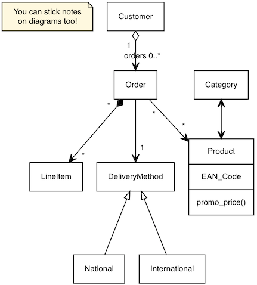

# yUML diagrammer
Allows the creation of offline UML diagrams based on the [yUML Syntax](http://yuml.me/).

<a href="https://www.npmjs.com/package/yuml-diagram"></a>
[]()
[](https://dev.azure.com/jaime-olivares-f/yuml-diagram/_build/latest?definitionId=2&branchName=master)



## Features
* Currently, the following diagram types are supported: 
  + Class
  + Activity 
  + Use-case
  + State
  + Deployment
  + Package
  + Sequence
* Additional directives for altering diagram type and orientation
* Embedded rendering engine: **No need to call an external web service**

## yUML syntax
Please refer to the [wiki page](https://github.com/jaime-olivares/yuml-diagram/wiki)

## Installation
This library is published as a npm package [here](https://www.npmjs.com/package/yuml-diagram). For installing use:
````bash
npm install yuml-diagram
````

## Usage example
````javascript
const yuml_diagram = require('yuml-diagram');

var yuml = new yuml_diagram();
var svgLightBg = yuml.processYumlDocument(yumlText, false);
var svgDarkBg = yuml.processYumlDocument(yumlText, true);
````

Try a live example with **`RunKit`**: https://runkit.com/embed/r21r931hzoqm

## Contributing
For pull requests, please read [CONTRIBUTING.md](https://github.com/jaime-olivares/yuml-diagram/blob/master/CONTRIBUTING.md)

Have a nice diagram to show? Please send it for publishing here!

## Credits
* Syntax and some examples taken from [yuml.me](http://yuml.me/diagram/scruffy/class/samples)
* This package embeds a Javascript port of [Dot/Graphviz](http://www.graphviz.org/) called [viz.js](https://github.com/mdaines/viz.js)
* The yuml-to-dot translator is loosely based on a Python project called [scruffy](https://github.com/aivarsk/scruffy)
* The new sequence diagram is based on [this github fork](https://github.com/sharvil/node-sequence-diagram)
